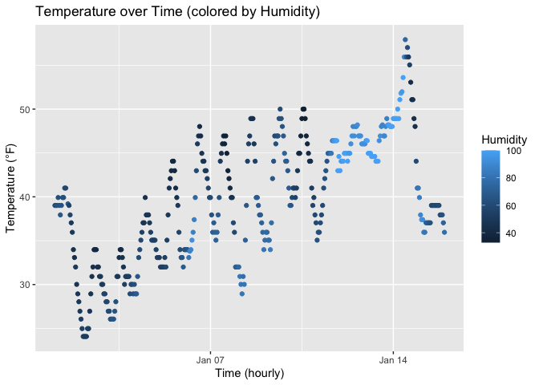

p8105_hw1_ao2965
================
2025-09-19

``` r
library(moderndive)
data("early_january_weather")
library(ggplot2)
ggplot(early_january_weather, aes(x = time_hour, y = temp,color = humid)) + geom_point()
```

<!-- -->
